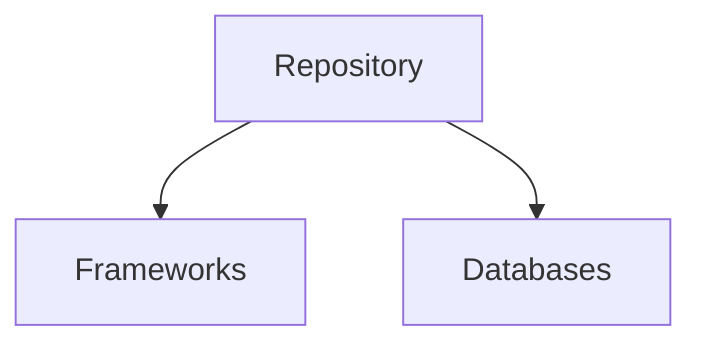
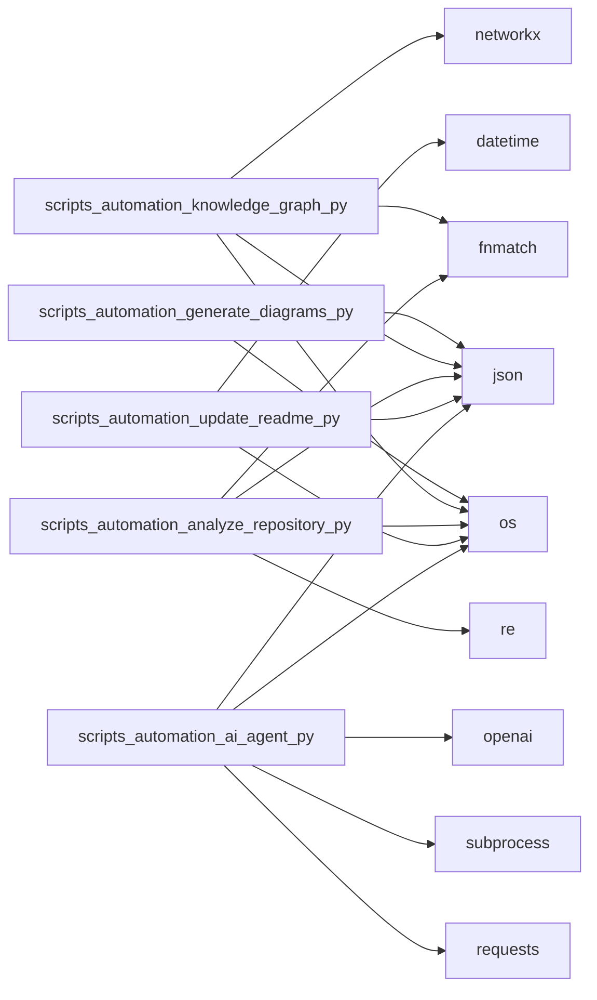

# Autonomous Repository Analysis

> This repository is self-documenting. The architecture, state, and dependency graphs are automatically generated and updated via GitHub Actions.
> Last updated: 2026-06-19 07:05:14 UTC


## Project Overview
This repository features an automated documentation and analysis system that continuously maps its own architecture, dependencies, and codebase structure.

## Technology Stack

### Languages Detected
- **.md**: 2 files
- **.json**: 2 files
- **.pbix**: 1 files
- **.txt**: 1 files
- **.py**: 5 files
- **.html**: 1 files
- **.mmd**: 3 files

### Frameworks & Libraries
- None detected explicitly yet.

### Databases
- None detected explicitly yet.

## System Architecture



## Dependency Map



## Environment Variables
The following environment variables were detected in sample `.env` files:
- None detected explicitly yet.

## Repository Structure

```
.
├── scripts/
├── docs/
```

## Setup Instructions
1. Clone the repository.
2. Ensure you have Python 3.10+ installed.
3. (Optional) Create a virtual environment: `python -m venv venv && source venv/bin/activate`
4. Install requirements: `pip install -r scripts/automation/requirements.txt`
5. Run the automation scripts locally if desired.

## Deployment Instructions
This system is purely automated via GitHub Actions. There is no active server to deploy.
1. Commit the `.github/workflows/` directory to your repository.
2. Ensure the `OPENAI_API_KEY` secret is configured in your repository settings to enable the AI agent.
3. Push to `main` to trigger the CI/CD and automation pipelines.

## API Documentation
Currently, this repository operates locally and via GitHub Actions without exposing external APIs.

## Changelog Summaries
View the repository's commit history for granular updates. The AI agent will automatically summarize PR changes.

## Status Badges


## Contribution Guide
To contribute:
1. Make your changes.
2. The GitHub Actions workflows will automatically analyze the repository.
3. The README and architecture diagrams will be regenerated and committed back to your PR or `main`.
4. The AI Documentation Agent will review your PR and provide summaries.
